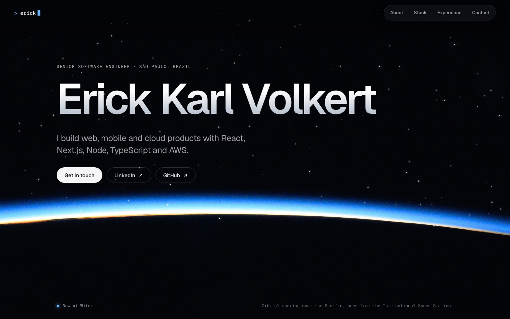

# Erick Karl Volkert — Portfolio

[](https://erickkarl.dev)
[](https://erickkarl.dev/storybook/)
[](https://github.com/erickkarl/portfolio/actions/workflows/deploy.yml)


Personal portfolio of a senior software engineer, art-directed as a view from orbit: a terminal-style intro types my name, then the site opens on the first light of an orbital sunrise photographed from the ISS.

[](https://erickkarl.dev)

Design guided by the `apple-design` (Emil Kowalski) and `build-awwwards-quality-sites` (Meng To) skills: size-specific type tracking, a translucent floating nav, press feedback, word-by-word reveals, a scroll-drawn career trajectory, a live starfield (drifting stars, shooting stars, a passing satellite, and fine stardust that trails the pointer), and full reduced-motion / no-JavaScript fallbacks.

**Live:** https://erickkarl.dev · **Components:** https://erickkarl.dev/storybook/

Built with the same stack I use at work:

| Tool | Used for |
| --- | --- |
| Next.js 16 (App Router) + React 19 | Static export of the site |
| TypeScript | Typed content model and components |
| CSS Modules + design tokens | Styling and the single dark "orbit" theme |
| GSAP + ScrollTrigger, Lenis | Choreography and the one smooth-scroll engine |
| Iconify (Tabler, SVG Logos, Simple Icons) | Interface icons and technology marks, rendered to inline SVG at build |
| Storybook 10 | Component catalogue with a11y checks and interaction tests |
| Vitest + Testing Library | Tests for the intro and the tech stack |
| GitHub Actions | CI on every branch, deploy to GitHub Pages from `main` |

## Editing content

Everything on the page comes from [`src/content/profile.ts`](src/content/profile.ts). Change the data there; the components only render it.

## Scripts

```bash
pnpm install
pnpm dev              # http://localhost:3000
pnpm test             # Vitest
pnpm lint && pnpm typecheck
pnpm build            # static export to ./out
pnpm storybook        # http://localhost:6006
```

## Structure

```
src/
  app/            layout, page, global tokens, fonts
  assets/media/   NASA photographs (see src/content/media.ts for provenance)
  components/     Intro, Motion, SpaceField, TechStack, Experience, SectionHeading, SplitWords, Icon, Photo
  content/        profile.ts — all page content
.github/workflows ci.yml, deploy.yml
```

## Deployment

`deploy.yml` runs lint, typecheck and tests, builds the site (base path comes from the Pages config, empty on the custom domain), builds Storybook into `out/storybook`, and publishes to GitHub Pages.

## Assets

Every asset is usable without on-page attribution:

- Photographs: NASA, public domain — [ISS071-E-000922](https://images.nasa.gov/details/iss071e000922) (cropped) and [ISS066-E-023323](https://images.nasa.gov/details/iss066e023323). Provenance lives in `src/content/media.ts`.
- Interface icons: [Tabler Icons](https://tabler.io/icons), MIT.
- Technology marks: [SVG Logos](https://github.com/gilbarbara/logos) and [Simple Icons](https://simpleicons.org), CC0. Logos are trademarks of their respective owners.
